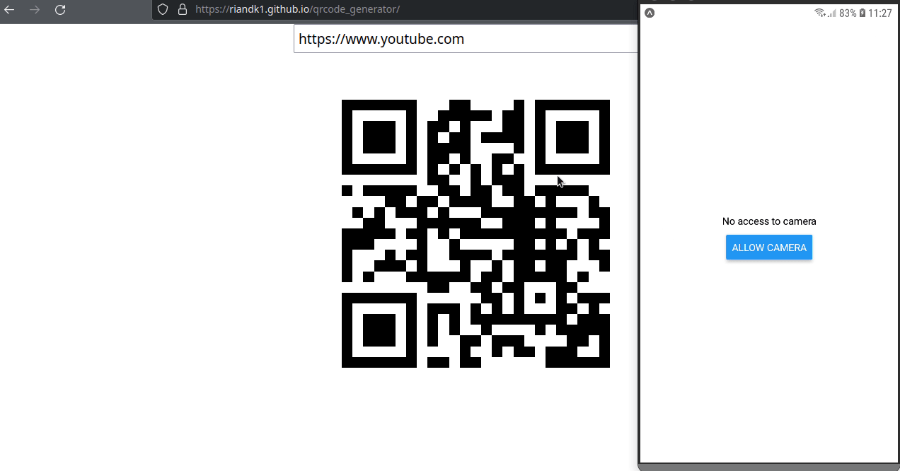

<div>
  <h1 align="center">QR Code Generator</h1> 
</div>
  
 <div align="center">
  
 </div>
  
  <br>
  
 ## 💻 Project
 This app was developed in Javascript and React Native. It is a QR code and barcode reader.
 
<h3>In this application you can:</h3>

<ul>
<li>Point the device's camera at any QR code or barcode to reveal the content in text form.</li>
</ul>

## 🚀 Installation

- Important: You must have installed the Expo, Yarn and Git.

```bash
# clone it
$ git clone https://github.com/riandk1/qrcode_generator.git
# Install dependencies
$ yarn
# Running script
$ expo start
```
And scan the QR code generated using the Expo Go app.

## 🧪 Technologies

This project was developed with the following technologies:

-  React Native

-  Javascript
